# general approach
* [Constraint-Aware Deep Neural Network Compression](http://www.sfu.ca/~ftung/papers/constraintaware_eccv18.pdf)
  * 文章的中心思想引入*constrained Basyesian optimization* 在给定的限制下找到最好的超参数
        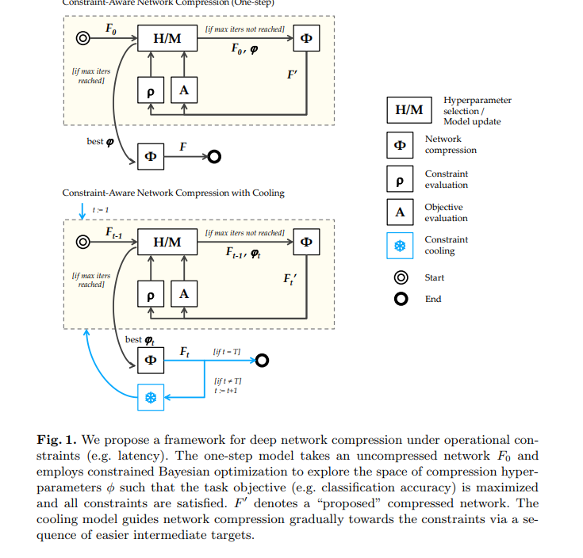
  * 作者利用 *Bayesian Optimization* 能够在参数空间中 *one-step* 找到最优解，但是并非最优 ，*This gradual trajectory provides a sequence of easier targets that approach the constraints, and is governed by a cooling schedule.* 于是，通过引入 *cooling function* ，就是将最终目标划分为多个小目标，于是最终的算法如下
        
  * 其中，作者将寻找最优参数的过程建模成 *Gaussian process* （*A Gaussian process is an uncountable set of random variables, any finite subset of which is jointly Gaussian.* ，能够很好地利用先验概率）。
        
  * cooling function 分为 linear 和 exponential，分成T轮逐步完成最终目标
    * linear: gt=pi(F0)+t/T\*(ci-pi(F0)),可见t=T时，完成最终的压缩
    * exponential： gt=c+e^(t/T)
      
* [Designing by Training: Acceleration Neural Network for Fast High-Dimensional Convolution](https://dailongquan.github.io/files/publications/nips2018(1).pdf)
  * 针对高维卷积耗时的问题，提出Acceleration Network (AccNet)，将耗时在设计快速的算法变成训练AccNet的工作
  * 过程分为两步
    * 将splatting, blurring, slicing转为卷积操作
    * 将如上的卷积操作变成 *g* CP layers 去构造AccNet，当训练完成后，激活函数 *g* 和AccNet权重一起定义了新的splatting, blurring and slicing操作

# quantization
* [LQ-Nets: Learned Quantization for Highly Accurate and Compact Deep Neural Networks](http://cn.arxiv.org/abs/1807.10029)
  * 传统的手动量化很死板，灵活的方法不能改变方式的死板，所以需要训练一个量化器 train a QNN and its *quantizer* 量化器随着网络一起训练，基于 * quantization error minimization* 达到最好的效果，*权值* 和 *激活* 皆量化，针对任意bit的量化，逐层且不共享权值
        
  * 其中左边是mask，右边是量化器，通过增加这样操作可以增强量化数据的表达范围
        
  * 作者用如下的 *quantization error minimization* 来衡量量化误差，其中 *p(x)* 是输入数据的概率密度函数
        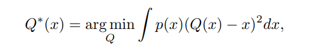
  * 文章的量化为vector quantization的变形，*Q=vTel* 这里的*vT* 指代这我们学习的量化的值，*e<subl* 是mask，值域{-1，1}或者{0，1}都可以。 所以也就是通过学习到的值和mask相乘得到量化后的值。文章的量化器的优化也就是优化*vT* 的值使得能够更好地去表达数据
  * 举例如此时的全连接网络中，我们量化的权值和通过激活层的输入的计算方式如下
        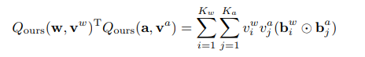
  * *quantization error* 的公式是用*l2* 范式累加量化后的数据和原始数据的误差,此时在反向传播中有两个量需要优化，一个是mask一个是VT
         
  * 于是用 *block coordinate descent* 的方式，首先用上一次的V更新这次的B，再用这次的B更新这次的V
    * B是用2^k暴力找到使得 *quantization error* 最小的
    * V是用loss求(BBT)-1BX 最小
         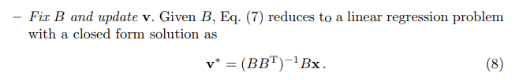
    * 每轮重复T次，通常设为1，因为作者实验中增大T没有明显作用
  * 实验结果
    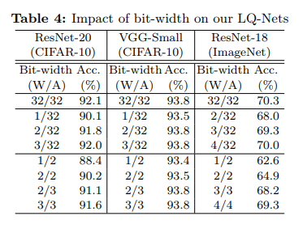 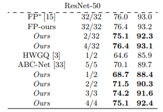
* [Value-aware Quantization for Training and Inference of Neural Networks](https://arxiv.org/abs/1804.07802)
  * *facebook and SNU*
  * 当值域分布越广，量化误差便会越大。由值分布可知，值越小，数目越多，故作者只对*small data*进行量化。本身小数据而言，对网络的影响就很小，故这种量化方法会大大减小量化误差。作者对activations和weights各有一个ratio评判是否为大数据
     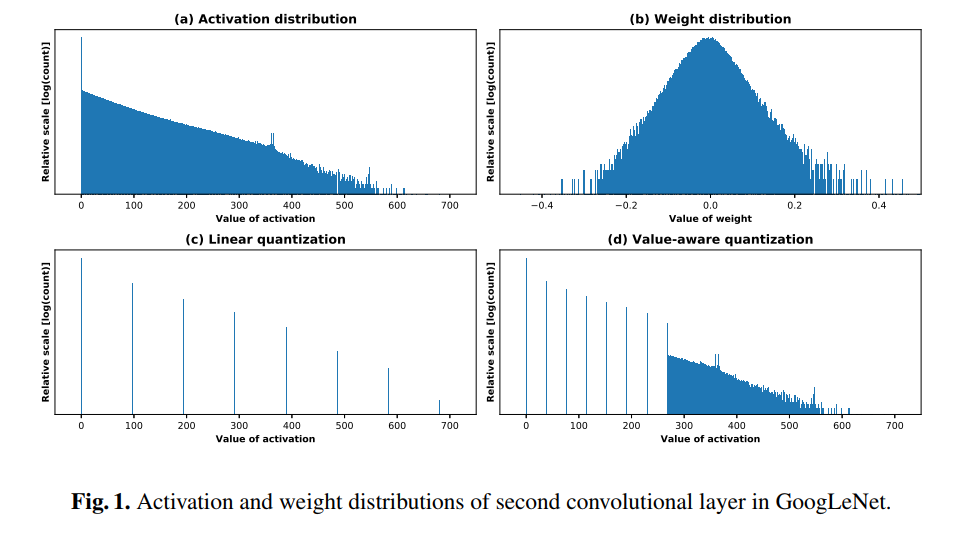
  * 算法：首先在*training*和*inference*阶段定义出什么是*large data*，再只对*small data*量化，*large data* 保持原有精度
    * 为了能够将weights和activations同时都做量化，在训练过程作者作了如下修正
      * 在整个前向过程中全使用全精度计算，所以所得的loss与原网络无异。
      * 反向时用存于本地的quantized activations副本计算梯度
        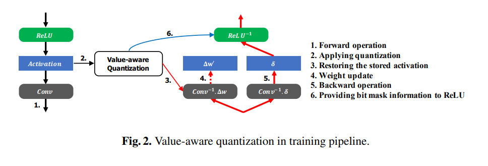
      * 并行训练时，为了避免数据通信的消耗，将*sorting*和*identifying* *large data*只在每张GPU本地完成
        * 并行训练时，每张卡各自量化（各自选择*threshold value*），实验表明并没有很大影响
      * 为了减少额外的mask内存消耗，每个神经元要么存mask信息，要么存*output activation*
        * 当k-bit，2k-1表示value，剩下的一个代表mask
      * *activation annealing*：整个训练过程中的*amount of latge data*波动很大，个数随着iter增多由多变少，所以采用一个逐步的方法
* [Deep Neural Network Compression with Single and Multiple Level Quantization](https://arxiv.org/abs/1803.03289)
  * 本文参照《Quantized Convolution Neural Networks for Mobile Devices》的 *分层量化* 和 *k-means聚类共享权值* 和《Incremental Network Quantization：Towards Lossless CNN with Low-Precision Weights》的 *逐步量化*
    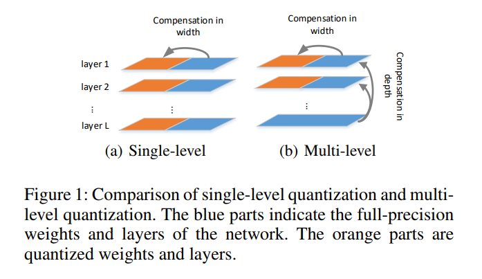
    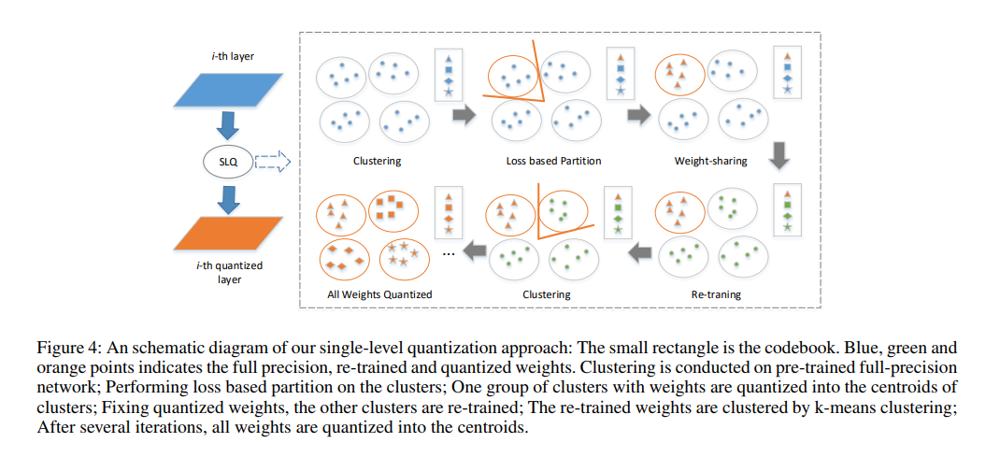
  * 首先*single level quantization*，参数聚类成簇，不同于INQ先量化更大值的参数（基于pruning的灵感），该方法使用基于量化损失的参数划分，量化损失大的簇先被量化(大概是觉得量化损失小的，比较容易用于恢复精度，即变化幅度小)。
      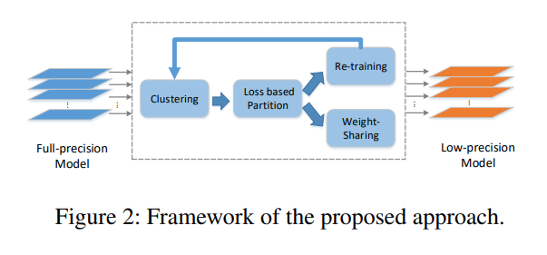
     * 只能对相对高一点精度的量化（8-bit等），当bit较小时，低精度（2-bit等）类数目少，量化误差无法弥补
     * 用mask表示是否被量化，训练只更新未被量化的值，弥补量化带来的loss
     * loss组成为网络本身的loss和（scalar\*量化的误差)
  * *extend SLQ* 8-bit 量化划分为 8-centroids这种
  * *mutiple level quantization*
     * 不同于SLQ一下把每层的待量化层都量化了，MLQ逐层量化待量化层。
     * MLQ的k-means聚类方法的k=3,将影响网络效果大的两个簇称为Boundaries，将影响最小的簇称为heart
      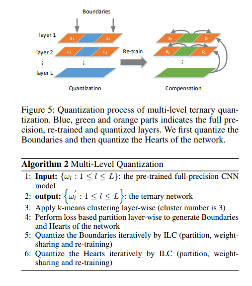
  * *Experiment Results*
     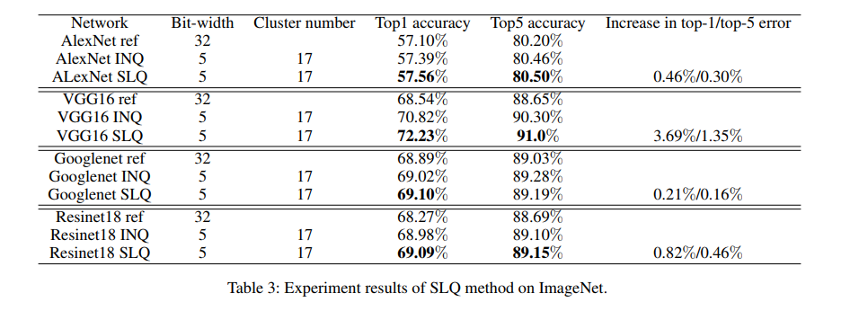
* [Scalable methods for 8-bit training of neural networks](https://arxiv.org/abs/1805.11046)

# pruning
* [Discrimination-aware Channel Pruning for Deep Neural Networks](https://arxiv.org/abs/1810.11809)
  * Tencent AI Lab *discrimination-aware channel pruning*
  * 这篇文章首先认为通道剪枝能够确保剪枝后模型与现有深度学习框架兼容，避免非规整的稀疏运算。其次现有的剪枝方法要么通过对通道强加稀疏约束从头训练，要么极小化预训练特征和压缩后特征之间的重构误差。这两个策略都存在不足：前者计算量大并且难以收敛，后者只关注重构误差而忽略了通道的判别能力。考虑 *discrimination-aware loss* and *reconstruction error*
  * 传统channel pruning缺陷
    * 传统利用mean squared error作为 *reconstruction error* 衡量通道重要性的方法很受模型效果的影响
    * 网络中间层的某些对结果没有贡献的通道可能会被错误地保存着，影响到剪枝的效果
    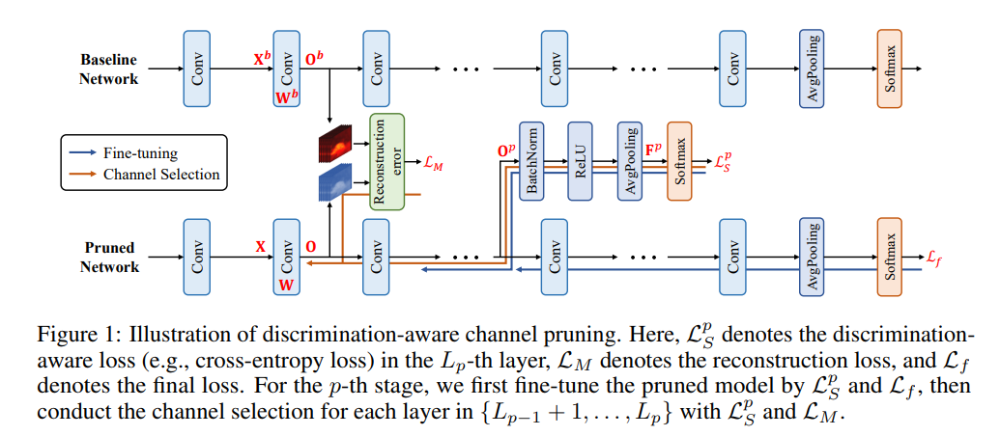
  * 于是，作者提出了整体算法框架：首先在第p阶段，结合Lp层的辅助损失L(p,s)与剪枝网络最终的分类损失Lf，更新第p-1阶段剪枝得到的模型，以恢复整体精度与特征的鉴别力；然后执行第p阶段的剪枝操作，以输出特征重建误差和辅助损失L(p,s)的联合loss作为优化目标，采用贪心策略完成channel selection，进而完成中的各个layer的剪枝。如此反复迭代，直至完成整体网络的剪枝目标。
    * 其中，Lp层的辅助损失（提升通道特征的鉴别能力）
      * 将Lp层的output feature map作为输入
        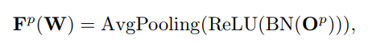
      * 再接入softmax得到L(p,s)计算公式为
        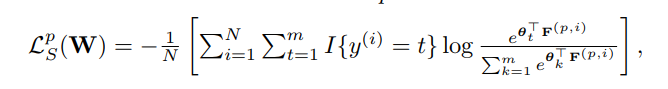
      * 于是最终的优化问题表达为带不等式约束的优化问题，这里的系数通常设为1
  * 在剪枝阶段，需要最小化的 *reconstruction error* 计算方式为剪枝后模型的featuremap和baseline之间的mean squzred error ，于是最终的loss function表达为
    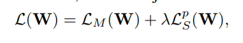
  * 于是最终的算法如下
    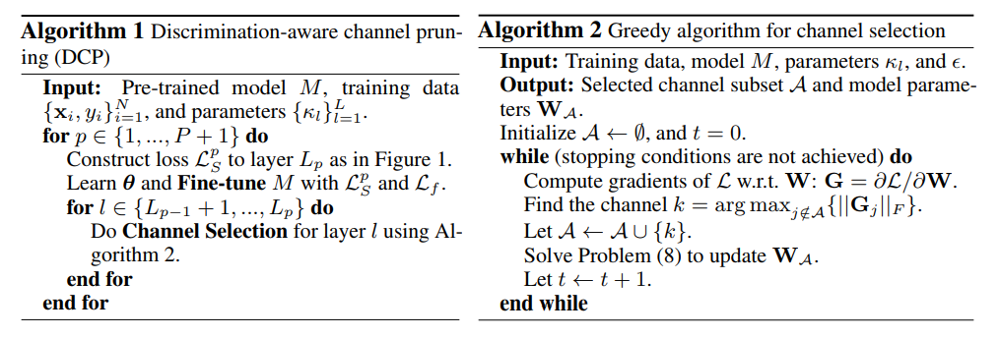
  * 其中，文章采用贪心策略求解剪枝问题，最小化重建误差与辅助loss联合目标L。在每次迭代时，首先计算联合目标L对Wj的梯度（Wj 表示第j 输入通道的卷积核参数），然后选择对梯度响应最大的通道j 加入到集合A中。由于联合loss中包含了鉴别力感知的辅助loss，因此所选择的输入特征通道具有较强的鉴别力。
  * channel selection的终止条件
    * 可以预先给定一个剪枝率
    * 当难以确定剪枝率时。可以通过按照当前相邻优化的绝对差值变化相对于迭代开始时的比值小于设定的容忍度
      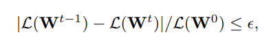
  * 实验结果
    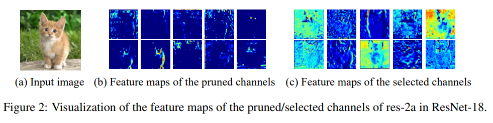
    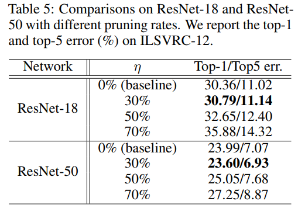
# other perspective
* [DeepRebirth: Accelerating Deep Neural Network Execution on Mobile Devices](https://aaai.org/ocs/index.php/AAAI/AAAI18/paper/view/16652)
  * 本文却另辟蹊径，从非权重层入手来进行模型压缩。
  * 如ResNet、GoogLenet等的卷积层都是由很小的卷积核组成，本身就非常紧致了，并且也去掉了非常占参数量的全连接层。而Non-tensor layer（也就是非权重层，如pooling、BN、LRN、ReLU等等）反而成为了模型在cpu以及其他嵌入式硬件上达到real-time的最大阻碍
  * *streamline*
    * 将这一连串的层合并起来(Non-Tensor层（Pooling、LRN）),对于Pooling层，将stride直接乘到Conv层中
  * *branch merging*
    * 主要针对GoogLeNet中的Inception结构
    * 作者将比较细小的卷积层（1*1）以及Pooling层所在的分支，直接合并到和它并排的大卷积分支中
  * 对于一个预训练模型，作者逐层进行合并，合并得到的 *新层* 使用 *标准的初始化方式* ，*其他层的参数保留原预训练模型的参数*，然后将新层的学习率调高为其他层的10倍，进行finetuning，对于某些层，如GoogLenet中的Inception 4b-4d可以一起进行合并在finetuning。
* [Deep k-Means: Re-Training and Parameter Sharing with Harder Cluster Assignments for Compressing Deep Convolutions](http://cn.arxiv.org/abs/1806.09228)
